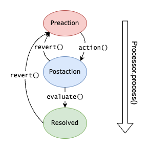

# Gnomalies
Reversible, controlled anomaly detection and management 

<p>
</p>
{height=300 align=right}


## Table of Contents

<!-- toc -->

- [Example](#example)
- [Anomalies](#anomalies)
- [Processor](#processor)
- [Subclassing notes](#subclassing-notes)
- [Todo](#todo)
- [Acknowledgements](#acknowledgements)
- [License](#license)
- [API](#api)
  * [Gnomalies](#gnomalies)

<!-- tocstop -->

## Example
```
const Gnomalies = require("../index.js");

// This Anomaly "fixes" lowercase letters.  Skipping normal class syntax for brevity here...
class EvilLowercase extends Gnomalies.Anomaly {}
EvilLowercase.detect = async (system, opts) => system.str.match(/[a-z]/)?true:false;
EvilLowercase.prototype.action = async (system, opts) => system.str = system.str.toUpperCase();

// This one turns sad faces into happy faces
class SadFace extends Gnomalies.Anomaly {}
SadFace.detect = async (system, opts) => system.str.match(/😔/)?true:false;
SadFace.prototype.action = async (system, opts) => system.str = system.str.replace(/😔/g, "🙂");

// Here is a system with things to fix
let system ={ str: "Hello World 😔" };

(async ()=>{

    // Fix the system
    let processor = new Gnomalies.Processor([EvilLowercase, SadFace]);
    await processor.detect(system);  // processor.anomalies now contains relevant anomalies
    await processor.process(system);

    console.log(system.str); // "HELLO WORLD 🙂"

})();
```

## Anomalies 
We define a *system* as "an entity represented by a collection of values".  An *anomaly* is the condition that a subset of those settings are in an inferior state that could potentially be transformed into a superior state. The `Anomaly` class containes a set of functions that allow us to process these anomalies in a systematic way.

| Function that gets called        | Override this function    | Purpose                                                    |
|----------------------------------|---------------------------|------------------------------------------------------------|
| `Anomaly.detect(system, opts)`   | `_detect(system, opts)`   | Detect an anomaly (static function!)                       |
| `Anomaly.action(system, opts)`   | `_action(system, opts)`   | Correct the anomaly by changing `system`                   |
| `Anomaly.revert(system, opts)`   | `_revert(system, opts)`   | Undo `action()`                                            |
| `Anomaly.evaluate(system, opts)` | `_evaluate(system, opts)` | Evaluate the successfulness of `action()` or `revert()`    |
| `Anomaly.fingerprint(system)`    | `_fingerprint(system)`    | fingerprint(revert(action(system))) == fingerprint(system) |
| `Anomaly.serialize(opts, keys)`  | `_serialize()`            | Serialize ourself for storage                              |

As you can see, all normally overridden functions start with an `_underscore`.  Most of these functions have sensible defaults.  See examples and the function documentation.  Generally, when an anomaly is actioned we take before-and-after fingerprints so that we can ensure any reversion is done properly and actually results in a resoration of the original state.  We also check fingerprints before starting a reversion (to make sure we are reverting the same thing we actioned). By default, this is all done by taking the SHA256 hash of  `JSON.serialize(system)`.  Most of the time you will likely want to either (a) override `_fingerprint()` to call it's base function with a reduced set of keys - so we don't fingerprint the whole object - or else pass `{opts.use_fingerprints : false}` when you construct an Anomaly in order to turn fingerprinting off completely (not recommended).

## Processor
A helpful `Processor` class is included that can automate much of the anomaly detection, processing, error handling, and reversion work.  To use a Processor, pass an array of Anomaly classes (not instances!) to it's constructor.  Then call `.detect()`, passing a system.  The Processor will call each anomaly's `.detect()` method, constructing anomaly objects for those that return `true` and storing the resulting array in `.anomalies`.  You can then call `Processor.process()` to `.action()` each anomaly on the system.


When using `processor.process()`, errors thrown in `anomaly.action()` result in an automatic call to `anomaly.revert()`.   `revert()` will first check `.state` and  `.fingerprints` to see if we are in a restorable state - for example, if we are in the `preaction` state and `fingerprint() == fingerprints.preaction` then no change was made and nothing needs to be done.  If we are in a `postaction` state and `fingerprint() == fingerprints.postacton` we will call `_revert()`, re-check that `fingerprint()` now matches `fingerprints.preaction`, and leave the anomaly paused back in the `preaction` state.

If any of this fails, `revert()` throws an error and `.dirty` is set to `true`. 

Once you have processed all anomalies, you should check to see which ones are paused, and if any of those are dirty.



A few important departures from the original concept (//delete me after everyone is on board)
1. `Anomaly.state` tracks only the state of the anomaly with respect to the `action()`.  
2. Since 'paused' (or ManualReview) doesn't tell us anything about the state, it's actually just a property - not a state.  This is `.paused`.
3. Activity notifications about work being done are events (e.g. `Anomaly#activity` -> `{"activity" : "detect", "progress" : "45" }`)
4. We don't retain any logger references or emit 'error_log' events.  Instead we emit `Anomaly#log` events for all `Anomaly.log()` calls.  If you want to log these in a logger, just consume them from the `Processor`.

## Subclassing notes 
- Most overridden functions are `async`
- If you implement `revert()`, you are expected to store whatever data you need during `action()` in order to perform the reversion.  You can do this externally, in a database, or you can store the data within your subclass.
- You may emit Anomaly#activity with your progress, in percent.  `Anomaly` will emit 0 and 100 for you as bookends automatically.
- Use the built in `Anomaly.log.{debug|info|warn|error}()` methods for logging.  It is accessable via `.history`.  Each call will also emit `Anomaly#log` events, making it easy to connect with your external logging engine.

## Todo
- Make more tests?

## Acknowledgements

Thanks to Dr. Jonathan Van Schenck for developing the Anomaly Report concept.  This project is based on his original class.

## License

Copyright (c) 2022 Nova Dynamics

## API

<!-- api -->

<a name="module_Gnomalies"></a>

### Gnomalies

* [Gnomalies](#module_Gnomalies)
    * [.Anomaly](#module_Gnomalies.Anomaly)
        * [new Anomaly(params)](#new_module_Gnomalies.Anomaly_new)
        * _instance_
            * [.fingerprints](#module_Gnomalies.Anomaly+fingerprints) ⇒ <code>object</code> \| <code>string</code> \| <code>string</code>
            * [.dirty](#module_Gnomalies.Anomaly+dirty) ⇒ <code>boolean</code>
            * [.dirty](#module_Gnomalies.Anomaly+dirty)
            * [.use_fingerprints](#module_Gnomalies.Anomaly+use_fingerprints) ⇒ <code>boolean</code>
            * [.name](#module_Gnomalies.Anomaly+name) ⇒ <code>string</code>
            * [.paused](#module_Gnomalies.Anomaly+paused) ⇒ <code>boolean</code>
            * [.id](#module_Gnomalies.Anomaly+id) ⇒ <code>string</code>
            * [.history](#module_Gnomalies.Anomaly+history) ⇒ <code>array</code>
            * [.state](#module_Gnomalies.Anomaly+state) ⇒ <code>string</code>
            * [.action(system, opts)](#module_Gnomalies.Anomaly+action) ⇒ <code>Promise</code>
            * [._action(system, opts)](#module_Gnomalies.Anomaly+_action) ⇒ <code>Promise</code>
            * [.revert(system, opts)](#module_Gnomalies.Anomaly+revert) ⇒ <code>Promise</code>
            * [._revert(system, opts)](#module_Gnomalies.Anomaly+_revert) ⇒ <code>Promise</code>
            * [.evaluate(system, opts)](#module_Gnomalies.Anomaly+evaluate) ⇒ <code>Promise</code>
            * [._evaluate(system, opts)](#module_Gnomalies.Anomaly+_evaluate) ⇒ <code>Promise</code>
            * [.fingerprint(system, keys)](#module_Gnomalies.Anomaly+fingerprint) ⇒ <code>string</code>
            * [.iterations([state])](#module_Gnomalies.Anomaly+iterations) ⇒ <code>number</code>
            * [.pause(reason)](#module_Gnomalies.Anomaly+pause)
            * [.resume(reason)](#module_Gnomalies.Anomaly+resume)
        * _static_
            * [.allowed_states](#module_Gnomalies.Anomaly.allowed_states) ⇒ <code>array</code>
            * [.detect(system, opts)](#module_Gnomalies.Anomaly.detect) ⇒ <code>Promiose.&lt;boolean&gt;</code>
            * [._detect(system, opts)](#module_Gnomalies.Anomaly._detect) ⇒ <code>Promiose.&lt;boolean&gt;</code>
            * [.serialize(keys)](#module_Gnomalies.Anomaly.serialize) ⇒ <code>string</code>
            * [.from_serialized(str)](#module_Gnomalies.Anomaly.from_serialized) ⇒ <code>Anomaly</code>
    * [.Processor](#module_Gnomalies.Processor)
        * [new Processor([classes])](#new_module_Gnomalies.Processor_new)
        * [.anomalies](#module_Gnomalies.Processor+anomalies) ⇒ <code>Array.&lt;Anomaly&gt;</code>
        * [.classes](#module_Gnomalies.Processor+classes) ⇒ <code>Array.&lt;Anomaly&gt;</code>
        * [.anomalies_with_state(state)](#module_Gnomalies.Processor+anomalies_with_state) ⇒ <code>Array.&lt;Anomaly&gt;</code>
        * [.detect(system, opts)](#module_Gnomalies.Processor+detect)
        * [.process(system, opts)](#module_Gnomalies.Processor+process) ⇒ <code>Promise</code>
        * [.process_one()](#module_Gnomalies.Processor+process_one) ⇒ <code>Promise.&lt;(Anomaly\|null)&gt;</code>

<a name="module_Gnomalies.Anomaly"></a>

#### Gnomalies.Anomaly
Anomaly

To use this class, extend it and override .detect(), .action(), and any other methods you need.
If you are saving the anomaly for later use, you should also make sure .serialize() and .deserialize() will meet your needs.
If your processor will be using fingerprints, you should also make sure .fingerprint() will meet your needs.

**Kind**: static class of [<code>Gnomalies</code>](#module_Gnomalies)  

* [.Anomaly](#module_Gnomalies.Anomaly)
    * [new Anomaly(params)](#new_module_Gnomalies.Anomaly_new)
    * _instance_
        * [.fingerprints](#module_Gnomalies.Anomaly+fingerprints) ⇒ <code>object</code> \| <code>string</code> \| <code>string</code>
        * [.dirty](#module_Gnomalies.Anomaly+dirty) ⇒ <code>boolean</code>
        * [.dirty](#module_Gnomalies.Anomaly+dirty)
        * [.use_fingerprints](#module_Gnomalies.Anomaly+use_fingerprints) ⇒ <code>boolean</code>
        * [.name](#module_Gnomalies.Anomaly+name) ⇒ <code>string</code>
        * [.paused](#module_Gnomalies.Anomaly+paused) ⇒ <code>boolean</code>
        * [.id](#module_Gnomalies.Anomaly+id) ⇒ <code>string</code>
        * [.history](#module_Gnomalies.Anomaly+history) ⇒ <code>array</code>
        * [.state](#module_Gnomalies.Anomaly+state) ⇒ <code>string</code>
        * [.action(system, opts)](#module_Gnomalies.Anomaly+action) ⇒ <code>Promise</code>
        * [._action(system, opts)](#module_Gnomalies.Anomaly+_action) ⇒ <code>Promise</code>
        * [.revert(system, opts)](#module_Gnomalies.Anomaly+revert) ⇒ <code>Promise</code>
        * [._revert(system, opts)](#module_Gnomalies.Anomaly+_revert) ⇒ <code>Promise</code>
        * [.evaluate(system, opts)](#module_Gnomalies.Anomaly+evaluate) ⇒ <code>Promise</code>
        * [._evaluate(system, opts)](#module_Gnomalies.Anomaly+_evaluate) ⇒ <code>Promise</code>
        * [.fingerprint(system, keys)](#module_Gnomalies.Anomaly+fingerprint) ⇒ <code>string</code>
        * [.iterations([state])](#module_Gnomalies.Anomaly+iterations) ⇒ <code>number</code>
        * [.pause(reason)](#module_Gnomalies.Anomaly+pause)
        * [.resume(reason)](#module_Gnomalies.Anomaly+resume)
    * _static_
        * [.allowed_states](#module_Gnomalies.Anomaly.allowed_states) ⇒ <code>array</code>
        * [.detect(system, opts)](#module_Gnomalies.Anomaly.detect) ⇒ <code>Promiose.&lt;boolean&gt;</code>
        * [._detect(system, opts)](#module_Gnomalies.Anomaly._detect) ⇒ <code>Promiose.&lt;boolean&gt;</code>
        * [.serialize(keys)](#module_Gnomalies.Anomaly.serialize) ⇒ <code>string</code>
        * [.from_serialized(str)](#module_Gnomalies.Anomaly.from_serialized) ⇒ <code>Anomaly</code>

<a name="new_module_Gnomalies.Anomaly_new"></a>

##### new Anomaly(params)
constructor

**Throws**:

- <code>Error</code> if state is invalid


| Param | Type | Description |
| --- | --- | --- |
| params | <code>object</code> | parameters for this object |
| params.history | <code>array</code> | the log |
| params.id | <code>string</code> | the id |
| params.state | <code>string</code> | the state |
| params.paused | <code>boolean</code> | whether the anomaly is paused |

<a name="module_Gnomalies.Anomaly+fingerprints"></a>

##### anomaly.fingerprints ⇒ <code>object</code> \| <code>string</code> \| <code>string</code>
fingerprints (getter)

**Kind**: instance property of [<code>Anomaly</code>](#module_Gnomalies.Anomaly)  
**Returns**: <code>object</code> - fingerprints the fingerprints<code>string</code> - fingerprints.preaction the fingerprint before the action<code>string</code> - fingerprints.postaction the fingerprint after the action  
<a name="module_Gnomalies.Anomaly+dirty"></a>

##### anomaly.dirty ⇒ <code>boolean</code>
dirty (getter)

This flag is set by the processor to indicate we failed somewhere during a state transition

**Kind**: instance property of [<code>Anomaly</code>](#module_Gnomalies.Anomaly)  
**Returns**: <code>boolean</code> - true if this anomaly is dirty  
<a name="module_Gnomalies.Anomaly+dirty"></a>

##### anomaly.dirty
dirty (setter)

This flag is set by the processor to indicate we failed somewhere during a state transition

**Kind**: instance property of [<code>Anomaly</code>](#module_Gnomalies.Anomaly)  

| Param | Type | Description |
| --- | --- | --- |
| dirty | <code>boolean</code> | true if this anomaly is dirty |

<a name="module_Gnomalies.Anomaly+use_fingerprints"></a>

##### anomaly.use\_fingerprints ⇒ <code>boolean</code>
Use fingerprints (getter)

We don't have a setter for this because it is set in the constructor, and we can't go back and create fingerprints for all the actions we've already taken.

**Kind**: instance property of [<code>Anomaly</code>](#module_Gnomalies.Anomaly)  
**Returns**: <code>boolean</code> - true if we are configured to use fingerprints  
<a name="module_Gnomalies.Anomaly+name"></a>

##### anomaly.name ⇒ <code>string</code>
name (getter)

**Kind**: instance property of [<code>Anomaly</code>](#module_Gnomalies.Anomaly)  
**Returns**: <code>string</code> - the name of this anomaly  
<a name="module_Gnomalies.Anomaly+paused"></a>

##### anomaly.paused ⇒ <code>boolean</code>
paused (getter)

**Kind**: instance property of [<code>Anomaly</code>](#module_Gnomalies.Anomaly)  
**Returns**: <code>boolean</code> - true if this is paused  
<a name="module_Gnomalies.Anomaly+id"></a>

##### anomaly.id ⇒ <code>string</code>
id (getter)

**Kind**: instance property of [<code>Anomaly</code>](#module_Gnomalies.Anomaly)  
**Returns**: <code>string</code> - the id for this anomaly  
<a name="module_Gnomalies.Anomaly+history"></a>

##### anomaly.history ⇒ <code>array</code>
Log (getter)

**Kind**: instance property of [<code>Anomaly</code>](#module_Gnomalies.Anomaly)  
**Returns**: <code>array</code> - the log for this anomaly  
<a name="module_Gnomalies.Anomaly+state"></a>

##### anomaly.state ⇒ <code>string</code>
state (getter)

**Kind**: instance property of [<code>Anomaly</code>](#module_Gnomalies.Anomaly)  
**Returns**: <code>string</code> - the state of the anomaly  
<a name="module_Gnomalies.Anomaly+action"></a>

##### anomaly.action(system, opts) ⇒ <code>Promise</code>
Action

Performs the action for this anomaly.  If the anomaly is not in a preaction state, an error is thrown.  When using fingerprints, we take the fingerprint before and after calling _action().
Do not override me. Override _action() instead!

**Kind**: instance method of [<code>Anomaly</code>](#module_Gnomalies.Anomaly)  
**Returns**: <code>Promise</code> - promise that resolves when the action is complete  
**Throws**:

- <code>Error</code> error if the anomaly is not in a preaction state

**Emits**: [<code>activity</code>](#Anomaly+event_activity)  

| Param | Type | Description |
| --- | --- | --- |
| system | <code>object</code> | the system being analyzed |
| opts | <code>object</code> | arbitrary options |

<a name="module_Gnomalies.Anomaly+_action"></a>

##### anomaly.\_action(system, opts) ⇒ <code>Promise</code>
Action

Perform the action for this anomaly.
Override me to add specific behavior!

**Kind**: instance method of [<code>Anomaly</code>](#module_Gnomalies.Anomaly)  
**Returns**: <code>Promise</code> - promise that resolves when the action is complete  
**Throws**:

- <code>Error</code> error on error


| Param | Type | Description |
| --- | --- | --- |
| system | <code>object</code> | the system being analyzed |
| opts | <code>object</code> | arbitrary options |

<a name="module_Gnomalies.Anomaly+revert"></a>

##### anomaly.revert(system, opts) ⇒ <code>Promise</code>
Revert

Undo the action for this anomaly.  If we are in a preaction state and using fingerprints, we verify the fingerprint and then return.  Otherwise, we check that we match the postaction fingerprint; call _revert(), and then check the preaction fingerprint.  If any of this fails, we throw an error.
Do not override me. Override _revert() instead!

**Kind**: instance method of [<code>Anomaly</code>](#module_Gnomalies.Anomaly)  
**Returns**: <code>Promise</code> - promise that resolves when the reversion is complete  
**Throws**:

- <code>Error</code> error on error

**Emits**: [<code>activity</code>](#Anomaly+event_activity)  

| Param | Type | Description |
| --- | --- | --- |
| system | <code>object</code> | the system being analyzed |
| opts | <code>object</code> | arbitrary options |

<a name="module_Gnomalies.Anomaly+_revert"></a>

##### anomaly.\_revert(system, opts) ⇒ <code>Promise</code>
Revert

Undo the action for this anomaly.
Override me to add specific behavior!

**Kind**: instance method of [<code>Anomaly</code>](#module_Gnomalies.Anomaly)  
**Returns**: <code>Promise</code> - promise that resolves when the reversion is complete  
**Throws**:

- <code>Error</code> error on error


| Param | Type | Description |
| --- | --- | --- |
| system | <code>object</code> | the system being analyzed |
| opts | <code>object</code> | arbitrary options |

<a name="module_Gnomalies.Anomaly+evaluate"></a>

##### anomaly.evaluate(system, opts) ⇒ <code>Promise</code>
Evaluate

Evaluate the success of our action.
Throw an error if you believe the action or reversion failed.
Can also be used for post-action cleanup, statistics, etc.
Do not override me. Override _evaluate() instead!

**Kind**: instance method of [<code>Anomaly</code>](#module_Gnomalies.Anomaly)  
**Returns**: <code>Promise</code> - promise that resolves when the evaluation is complete  
**Throws**:

- <code>Error</code> error on error

**Emits**: [<code>activity</code>](#Anomaly+event_activity)  

| Param | Type | Description |
| --- | --- | --- |
| system | <code>object</code> | the system being analyzed |
| opts | <code>object</code> | arbitrary options |

<a name="module_Gnomalies.Anomaly+_evaluate"></a>

##### anomaly.\_evaluate(system, opts) ⇒ <code>Promise</code>
Evaluate

Evaluate the success of our action.
Throw an error if you believe the action or reversion failed.
Can also be used for post-action cleanup, statistics, etc.
Override me to add specific behavior!

**Kind**: instance method of [<code>Anomaly</code>](#module_Gnomalies.Anomaly)  
**Returns**: <code>Promise</code> - promise that resolves when the evaluation is complete  

| Param | Type | Description |
| --- | --- | --- |
| system | <code>object</code> | the system being analyzed |
| opts | <code>object</code> | arbitrary options |

<a name="module_Gnomalies.Anomaly+fingerprint"></a>

##### anomaly.fingerprint(system, keys) ⇒ <code>string</code>
Fingerprint

Fingerprint the system.  Base implementation is to convert specified keys (or all keys) to a string,
then calculate the SHA256 hash of the string.

**Kind**: instance method of [<code>Anomaly</code>](#module_Gnomalies.Anomaly)  
**Returns**: <code>string</code> - the fingerprint  
**Throws**:

- <code>Error</code> error on error


| Param | Type | Default | Description |
| --- | --- | --- | --- |
| system | <code>object</code> |  | the system being analyzed |
| keys | <code>array.&lt;string&gt;</code> | <code></code> | the keys to include in the fingerprint |

<a name="module_Gnomalies.Anomaly+iterations"></a>

##### anomaly.iterations([state]) ⇒ <code>number</code>
State iterations counter

Show how many times we have transitioned to a given state

**Kind**: instance method of [<code>Anomaly</code>](#module_Gnomalies.Anomaly)  
**Returns**: <code>number</code> - the number of times we have transitioned to this state  

| Param | Type | Default | Description |
| --- | --- | --- | --- |
| [state] | <code>string</code> | <code>&quot;\&quot;postaction\&quot;&quot;</code> | the state to count |

<a name="module_Gnomalies.Anomaly+pause"></a>

##### anomaly.pause(reason)
pause

Pause this anomaly

**Kind**: instance method of [<code>Anomaly</code>](#module_Gnomalies.Anomaly)  
**Emit**: Anomaly#pause  

| Param | Type | Description |
| --- | --- | --- |
| reason | <code>string</code> | the reason for the pause |

<a name="module_Gnomalies.Anomaly+resume"></a>

##### anomaly.resume(reason)
resume

Resume this anomaly

**Kind**: instance method of [<code>Anomaly</code>](#module_Gnomalies.Anomaly)  
**Emit**: Anomaly#resume  

| Param | Type | Description |
| --- | --- | --- |
| reason | <code>string</code> | the reason for the resume |

<a name="module_Gnomalies.Anomaly.allowed_states"></a>

##### Anomaly.allowed\_states ⇒ <code>array</code>
allowed_states (getter)

**Kind**: static property of [<code>Anomaly</code>](#module_Gnomalies.Anomaly)  
**Returns**: <code>array</code> - the allowed states  
<a name="module_Gnomalies.Anomaly.detect"></a>

##### Anomaly.detect(system, opts) ⇒ <code>Promiose.&lt;boolean&gt;</code>
Detect wrapper

Detect an anomaly.
Don't override me. Override _detect() instead!

**Kind**: static method of [<code>Anomaly</code>](#module_Gnomalies.Anomaly)  
**Returns**: <code>Promiose.&lt;boolean&gt;</code> - true if an anomaly is detected  
**Throws**:

- <code>Error</code> error on error


| Param | Type | Description |
| --- | --- | --- |
| system | <code>object</code> | the system being analyzed |
| opts | <code>object</code> | arbitrary options |

<a name="module_Gnomalies.Anomaly._detect"></a>

##### Anomaly.\_detect(system, opts) ⇒ <code>Promiose.&lt;boolean&gt;</code>
Detect

Detect an anomaly.
Override me to add specific behavior!

**Kind**: static method of [<code>Anomaly</code>](#module_Gnomalies.Anomaly)  
**Returns**: <code>Promiose.&lt;boolean&gt;</code> - true if an anomaly is detected  
**Throws**:

- <code>Error</code> error on error


| Param | Type | Description |
| --- | --- | --- |
| system | <code>object</code> | the system being analyzed |
| opts | <code>object</code> | arbitrary options |

<a name="module_Gnomalies.Anomaly.serialize"></a>

##### Anomaly.serialize(keys) ⇒ <code>string</code>
Serialize

Serialize this anomaly for storage.  By default, we serialize the following keys: #id, #name, #state, #log, #paused
The result is consumed by the constructor, which expects a JSON string whose keys represent the properties to restore.

If you override this funciton, you should call super.serialize() and add your own keys to the result.

**Kind**: static method of [<code>Anomaly</code>](#module_Gnomalies.Anomaly)  
**Returns**: <code>string</code> - the serialized anomaly  
**Throws**:

- <code>Error</code> error on error


| Param | Type | Description |
| --- | --- | --- |
| keys | <code>array.&lt;string&gt;</code> | the keys to serialize |

<a name="module_Gnomalies.Anomaly.from_serialized"></a>

##### Anomaly.from\_serialized(str) ⇒ <code>Anomaly</code>
From Serialized

Create an anomaly from a serialized string.  The string is expected to be a JSON string whose keys represent the properties to restore.

**Kind**: static method of [<code>Anomaly</code>](#module_Gnomalies.Anomaly)  
**Returns**: <code>Anomaly</code> - the anomaly  
**Throws**:

- <code>Error</code> error on error


| Param | Type | Description |
| --- | --- | --- |
| str | <code>string</code> | the serialized anomaly |

<a name="module_Gnomalies.Processor"></a>

#### Gnomalies.Processor
AnomalyProcessor

Detect and process anomalies in a queue.  Call the constructor with an array of Anomaly classes, then await .detect() and .process()

**Kind**: static class of [<code>Gnomalies</code>](#module_Gnomalies)  

* [.Processor](#module_Gnomalies.Processor)
    * [new Processor([classes])](#new_module_Gnomalies.Processor_new)
    * [.anomalies](#module_Gnomalies.Processor+anomalies) ⇒ <code>Array.&lt;Anomaly&gt;</code>
    * [.classes](#module_Gnomalies.Processor+classes) ⇒ <code>Array.&lt;Anomaly&gt;</code>
    * [.anomalies_with_state(state)](#module_Gnomalies.Processor+anomalies_with_state) ⇒ <code>Array.&lt;Anomaly&gt;</code>
    * [.detect(system, opts)](#module_Gnomalies.Processor+detect)
    * [.process(system, opts)](#module_Gnomalies.Processor+process) ⇒ <code>Promise</code>
    * [.process_one()](#module_Gnomalies.Processor+process_one) ⇒ <code>Promise.&lt;(Anomaly\|null)&gt;</code>

<a name="new_module_Gnomalies.Processor_new"></a>

##### new Processor([classes])
Create a new Processor

**Returns**: <code>Processor</code> - the new Processor  
**Throws**:

- <code>Error</code> if classes is not an array


| Param | Type | Default | Description |
| --- | --- | --- | --- |
| [classes] | <code>Array.&lt;Anomaly&gt;</code> | <code>[]</code> | An array of Anomaly classes we may detect |

<a name="module_Gnomalies.Processor+anomalies"></a>

##### processor.anomalies ⇒ <code>Array.&lt;Anomaly&gt;</code>
Get all anomalies

**Kind**: instance property of [<code>Processor</code>](#module_Gnomalies.Processor)  
**Returns**: <code>Array.&lt;Anomaly&gt;</code> - the queue of anomalies  
<a name="module_Gnomalies.Processor+classes"></a>

##### processor.classes ⇒ <code>Array.&lt;Anomaly&gt;</code>
Get all classes

**Kind**: instance property of [<code>Processor</code>](#module_Gnomalies.Processor)  
**Returns**: <code>Array.&lt;Anomaly&gt;</code> - all Anomaly classes  
<a name="module_Gnomalies.Processor+anomalies_with_state"></a>

##### processor.anomalies\_with\_state(state) ⇒ <code>Array.&lt;Anomaly&gt;</code>
Get anomalies with a particular state

**Kind**: instance method of [<code>Processor</code>](#module_Gnomalies.Processor)  
**Returns**: <code>Array.&lt;Anomaly&gt;</code> - anomalies with the specified state  
**Throws**:

- <code>Error</code> if state is invalid


| Param | Type | Description |
| --- | --- | --- |
| state | <code>string</code> | The state to filter on |

<a name="module_Gnomalies.Processor+detect"></a>

##### processor.detect(system, opts)
Detect anomalies in a system

Adds anomalies to the queue

**Kind**: instance method of [<code>Processor</code>](#module_Gnomalies.Processor)  

| Param | Type | Description |
| --- | --- | --- |
| system | <code>object</code> | The system to detect anomalies in |
| opts | <code>object</code> | Options to pass to the detect() methods |

<a name="module_Gnomalies.Processor+process"></a>

##### processor.process(system, opts) ⇒ <code>Promise</code>
Process all anomalies

Processes all anomalies in the queue from the preaction state to the resolved state (if possible).  May call .action(), .evaluate(), .revert()
Events are bubbled up from each anomaly.  Anomalies that fail between states will be paused and will be set to `.dirty` state

**Kind**: instance method of [<code>Processor</code>](#module_Gnomalies.Processor)  
**Returns**: <code>Promise</code> - resolves when all anomalies are processed  
**Emits**: [<code>log</code>](#Anomaly+event_log), [<code>state</code>](#Anomaly+event_state), [<code>pause</code>](#Anomaly+event_pause), [<code>resume</code>](#Anomaly+event_resume), [<code>activity</code>](#Anomaly+event_activity)  

| Param | Type | Description |
| --- | --- | --- |
| system | <code>object</code> | The system to detect anomalies in |
| opts | <code>object</code> | Options to pass to the methods (action() etc) |

<a name="module_Gnomalies.Processor+process_one"></a>

##### processor.process\_one() ⇒ <code>Promise.&lt;(Anomaly\|null)&gt;</code>
Process one anomaly 

Finds the first (by order) anomaly with a state of "preaction" and processes it
to the resolved state (if possible).  May call .action(), .evaluate(), .revert()
Events are bubbled up. Anomalies that fail between states will be paused and will be set to `.dirty` state

**Kind**: instance method of [<code>Processor</code>](#module_Gnomalies.Processor)  
**Returns**: <code>Promise.&lt;(Anomaly\|null)&gt;</code> - the anomaly processed, or null if there are no anomalies to process.  You can check for success by checking the anomaly itself.  
**Emits**: [<code>log</code>](#Anomaly+event_log), [<code>state</code>](#Anomaly+event_state), [<code>pause</code>](#Anomaly+event_pause), [<code>resume</code>](#Anomaly+event_resume), [<code>activity</code>](#Anomaly+event_activity)  

<!-- apistop -->
